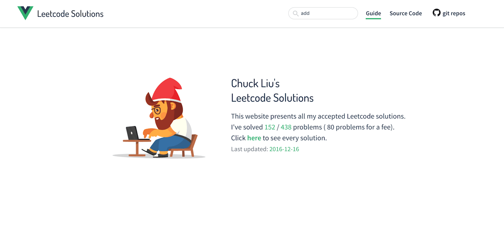

# leetcode-viewer

> 用无后台架构(backend-free)的Vue单页应用来分享、呈现你的leetcode解题源码吧!

[线上Demo在此](https://ma63d.github.io/#/cover)

只需要几行命令就可以立马搭建出一个完整的leetcode解题源码单页应用,完全无需后台,上传至github pages或你自己的服务器,即可一秒完整呈现你的leetcode源码.再结合多说等评论插件,**一个带搜索功能、带评论、带自己的解题心得、带源码、带leetcode题目的leetcode博客就这样搭建起来了，你，一行代码都不用写。**




## 本项目需结合[leetcode-spider](https://github.com/Ma63d/leetcode-spider)使用

[leetcode-spider](https://github.com/Ma63d/leetcode-spider)是我用JS写的leetcode解题源码爬虫, 自动将你的leetcode解题源码爬取下来,生成本地代码、题目文件.并生成本项目运行时所需的部分JSON文件.

**所以使用前请先爬取你自己的leetcode源码**


## usage 使用方法

``` bash

# 先clone/fork本项目 然后进入本项目所在文件夹

git clone https://github.com/Ma63d/leetcode-viewer.git 
cd leetcode-viewer

#安装npm依赖

npm i

# 然后按照lc-spider的使用方法 先爬下来你的leetcode解题源码 详见[leetcode-spider](https://github.com/Ma63d/leetcode-spider)使用介绍
# 我推荐您在leetcode-viewer/solutions目录下存放源码, 因此建议先cd solutions 
# 但并不强求, 只要存放在leetcode-viewer目录下即可
# 运行leetcode-spider 爬取源码

lc-spider

# 爬爬爬 爬好之后, 打包 生成应用

npm run build

# generate源码相关信息

npm run generate

# ok了 现在 这就是一个可以放在任何一个静态服务器上的单页应用了 你可以把他push 到github pages 或者放到你自己的服务器上

```

## writing posts 书写文章

你可以为每一道leetcode题目编写您自己的解题心得(也就是博客文章),如下图所示:

在题目的下方,会呈现你为该题编写的博客文章.
编写方法就是,在您爬取的源码目录下的具体的某一道题的文件夹下 建立一个`post.md`文件,并用markdown语法在里面书写你的文章.

**注意文件名只能是`post.md`,请勿改用其他名称**.

假设您的爬取源码是放在leetcode-viewer/solutions/下,再假设您用java AC了第一题001.two-sum,那么此时目录结构如下:

├── solutions
│   └───── 001.two-sum
│				└───── db.json // leetcode-viewer运行时所需的信息文件 
│				├───── question.md // leetcode-spider爬下来的这道leetcode的题目
│				├───── two-sum.java //leetcode-spider爬下来的你的解题源码
│				├───── post.md //你应该在此处创建该文件, 并在文件里用markdown语法书写你的文章


## config 配置

在`leetcode-viewer/`目录下有一个js文件[build.conf.js](./build.conf.js),可以在里面更改配置
配置项有如下几个

- sourcePath
  此路径填写为您存放目录leetcode源码文件的目录
- author
  此项填写为您的名字,这一项会用在封面页的介绍文字上,这一项会用在封面页的介绍文字上
  显示为 `{{author}}'s Leetcode solutions`
  如果你不想显示你的名字,就填写`null`, 
  介绍页面上会显示 `My Leetcode solutions`
- gitRepo
  如果你的leetcode源码已经存放在github上,那么此处可以填写为具体的项目地址
  这样,我会在导航栏添加一个链接到您的git项目地址
  否则,请保持`null`  
- language 
  网页的语言,主要是封面介绍页和顶部导航条的文字,`zh` 中文 `en` 英文
- duoShuoPlugin: false, 
  是否开启多数插件, 如果你开启此选项,请确保您已注册多说站点
  [多说](http://duoshuo.com/)是一个评论插件,可以为你的网站增加评论功能
- duoShuoShortName: 'your origin'
  您的多说二级域名,如果您开启了多说,则一定要将此处的多说域名修改为您自己的多说域名


