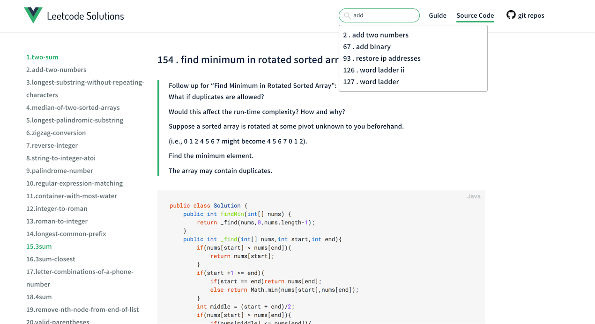

# leetcode-viewer

> 用无后台架构(backend-free)的Vue单页应用来分享、呈现你的leetcode解题源码吧!

[线上Demo在此](https://ma63d.github.io/#/cover)

只需要几行命令就可以立马搭建出一个完整的leetcode解题源码单页应用,完全无需后台,上传至github pages或你自己的服务器,即可一秒完整呈现你的leetcode源码.再结合多说等评论插件,**一个带搜索功能、带评论、带自己的解题心得、带源码、带leetcode题目的leetcode博客就这样搭建起来了，你，一行代码都不用写。**




如果你在使用当中有什么疑问或者有什么需求、改进建议,都可以开issue,发pr.

## 本项目需结合[leetcode-spider](https://github.com/Ma63d/leetcode-spider)使用

[leetcode-spider](https://github.com/Ma63d/leetcode-spider)是我用JS写的leetcode解题源码爬虫, 自动将你的leetcode解题源码爬取下来,生成本地代码、题目文件.并生成本项目运行时所需的部分JSON文件.

**所以使用前请先爬取你自己的leetcode源码**


## usage 使用方法


先clone/fork本项目 然后进入本项目所在文件夹

```
git clone https://github.com/Ma63d/leetcode-viewer.git 
cd leetcode-viewer
```

安装npm依赖

```
npm i
```
然后按照lc-spider的使用方法 先爬下来你的leetcode解题源码 详见[leetcode-spider](https://github.com/Ma63d/leetcode-spider)使用介绍

我推荐您在`leetcode-viewer/solutions`目录下存放源码,但只要保证是在`leetcode-viewer/`下都是可以的,如果您不是存放在`solutions`目录下,请参考后续章节[config](https://github.com/Ma63d/leetcode-viewer#config-配置),并修改其中的`sourcePath`

```
#进入您希望存放源码的目录,运行leetcode-spider,爬取源码
cd solutions 
lc-spider
```
**再强调一遍!!!如果你不是在solutions目录下爬取的源码,那么请记得更改[config](https://github.com/Ma63d/leetcode-viewer#config-配置)中的sourcePath为你的源码目录**


等leetcode-spider爬爬爬,爬好之后,打包生成应用

``` 
npm run build
```

generate源码相关信息
**需要注意的是这行命令也是需要在你的源码存放目录下执行**


``` bash
npm run generate 
#用时一般不会超过0.5秒 
```

ok了,现在,这就是一个可以放在任何一个静态服务器上的网页了.

你可以把他push 到github pages,或者放到你自己的服务器上,呈现出来了.


## writing posts 书写文章

你可以为每一道leetcode题目编写您自己的解题心得(也就是博客文章),如下图所示:

在题目的下方,会呈现你为该题编写的博客文章.
编写方法就是,在您爬取的源码目录下的具体的某一道题的文件夹下 建立一个`post.md`文件,并用markdown语法在里面书写你的文章.

**注意文件名只能是`post.md`,请勿改用其他名称**.

假设您的爬取源码是放在leetcode-viewer/solutions/下,再假设您用java AC了第一题001.two-sum,那么此时目录结构如下:

```
├── solutions
│   └───── 001.two-sum
│				└───── db.json // leetcode-viewer运行时所需的信息文件 
│				├───── question.md // leetcode-spider爬下来的这道leetcode的题目
│				├───── two-sum.java //leetcode-spider爬下来的你的解题源码
│				├───── post.md //你应该在此处创建该文件, 并在文件里用markdown语法书写你的文章
```
书写好新文章之后不需要任何指令,刷新页面就可以呈现出来!如果你是通过github pages或你自己的服务器上呈现的网页,上传到git或者你的服务器,就能生效.

## config 配置

**更新配置之后请重新执行`npm run build` 重新生成网页**

在`leetcode-viewer/`目录下有一个js文件[build.conf.js](./build.conf.js),可以在里面更改配置
配置项有如下几个

- sourcePath

  此路径填写为您存放目录leetcode源码文件的目录
- author

  此项填写为您的名字,这一项会用在封面页的介绍文字上
  
  显示为 `{{author}}'s Leetcode solutions`
  
  如果你不想显示你的名字,就填写`null`, 
  
  介绍页面上会显示 `My Leetcode solutions`
- gitRepo

  如果你的leetcode源码已经存放在github上,那么此处可以填写为具体的项目地址
  
  这样,我会在导航栏添加一个链接到您的git项目地址
  
  否则,请保持`null`  
- language 

  网页的语言,主要是封面介绍页和顶部导航条的文字,`zh` 中文 `en` 英文
- duoShuoPlugin: false, 

  是否开启多数插件, 如果你开启此选项,请确保您已注册多说站点
  
  [多说](http://duoshuo.com/)是一个评论插件,可以为你的网站增加评论功能
  
- duoShuoShortName: 'your origin' 

  您的多说二级域名,如果您开启了多说,则一定要将此处的多说域名修改为您自己的多说域名
  
## updating 更新

如果你在leetcode上又AC了一些题,并希望爬取下来,那你只需要再次进入到你的源码存放目录,然后执行命令`lc-spider`,就可以自动爬取下来你新解的题目.

> 我平常也是时不时解几道leetcode,所以我跟你的需求也是一样的,我也是有大量的增量爬取我最新写的代码的需求.因此我在编写[leetcode-spider](https://github.com/Ma63d/leetcode-spider)和leetcode-viewer时,为这种场景做了较多的优化.所以增量的爬取代码只需要再次进入到你的源码存放目录,然后执行命令`lc-spider`即可.如果你在以往AC的题目上提交了新的代码或者用其他编程语言再写了一遍,也可以爬,具体请查看[leetcode-spider](https://github.com/Ma63d/leetcode-spider).

新的代码爬下来之后需要再次执行,

```
npm run generate
```

[前面](https://github.com/Ma63d/leetcode-viewer#usage-使用方法)说过的哈,**这行命令是需要在你的源码存放目录下执行**

ok了,当前的网页呈现的是你的最新版代码.

## other 其他

如果你不熟悉Javascript, 可能会对`npm run build`和`npm run generate`这两条命令有点疑惑,

- `npm run build`是用来打包生成前端网页的, 除了[使用方法](https://github.com/Ma63d/leetcode-viewer#usage-使用方法)里所说的进行leetcode-viewer的安装工作的时候用,就**只有**在你更新了[build.conf.js](./build.conf.js)时才需要再次执行该命令,其余时候都不用.

- `npm run generate` 是用来生成网页运行的时候所需的一些JSON信息文件的,因此,如果你爬了新的代码,那么请记得爬好之后运行此命令,(而且再啰嗦一句,记得在leetcode源码目录运行此命令哈),而如果你是[写了新的博客文章](https://github.com/Ma63d/leetcode-viewer#writing-posts-书写文章),则不需要运行此命令,你要做的就是刷新网页


